# CAREZOA Backend — Architecture, Data Model & ER Diagram

This document is the single place to understand **everything inside
`carezoa-backend/`**: what the service does, how it's laid out, every
database table and how they relate, the booking lifecycle, and the
non-negotiable business rules baked into the code. Pair it with
[`README.md`](./README.md) (setup/run commands) and the top-level
[`../API.md`](../API.md) (HTTP contract shared with the mobile app).

---

## 1. What this service is

`carezoa-backend` is the **production-grade FastAPI implementation** of the
CAREZOA home-healthcare marketplace API — the same domain the Next.js
`/api/v1` mock (repo root) simulates for local frontend development, but with
real persistence, a real state machine, RBAC, audit logging, and background
workers. It is designed to eventually be the API the `mobile/` Expo app talks
to in staging/production.

**Stack:** Python 3.12 · FastAPI · SQLAlchemy 2.0 (async) · PostgreSQL ·
Alembic migrations · Redis · Celery (worker + beat) · MinIO/S3-compatible
object storage · structlog + OpenTelemetry.

**Core domain:** patients book verified home-care providers (nurses,
attendants, physiotherapists) for services delivered at home; a visit moves
through a strict lifecycle from booking to payment to arrival to completion;
payments, payouts, chat, family access, care plans, incidents and support are
all modeled explicitly.

---

## 2. Repository layout

```
carezoa-backend/
├── app/
│   ├── main.py                  # FastAPI app factory: exception handlers, router mounting, /health
│   ├── core/
│   │   ├── config.py             # Settings (env-driven) — DB/Redis URLs, JWT, OTP, payment/telephony/maps/S3 config
│   │   ├── security.py           # Password hashing, JWT issue/decode, OTP hashing, webhook signature verify, Role enum
│   │   ├── exceptions.py         # DomainError hierarchy → HTTP status mapping (404/403/401/409/429)
│   │   ├── logging.py            # structlog configuration
│   │   └── rate_limit.py         # In-process sliding-window limiter (swap for Redis in prod)
│   ├── db/
│   │   ├── base.py                # Declarative Base, naming convention, TimestampMixin (created_at/updated_at)
│   │   ├── session.py             # Async engine + session factory, get_session() FastAPI dependency
│   │   └── migrations/            # Alembic env + versions (0001_initial = full schema baseline)
│   ├── models/                    # SQLAlchemy ORM models — the source of truth for the schema (see §4)
│   │   ├── user.py, patient.py, catalog.py, provider.py, booking.py,
│   │   │   payment.py, communication.py, support.py, care_plan.py
│   ├── schemas/                   # Pydantic request/response models (per domain, mirrors routers/)
│   ├── state_machines/
│   │   └── booking_state_machine.py   # PURE stdlib visit lifecycle FSM — single source of truth (see §5)
│   ├── services/                  # Business logic — the only layer allowed to orchestrate repos + state machine
│   │   ├── booking_service.py        # ONLY module allowed to call booking_state_machine
│   │   ├── matching_service.py       # Pure weighted provider ranking (gates + scoring, price never dominant)
│   │   ├── anti_bypass_service.py    # Pure regex scanner: flags + scrubs contact/off-platform-payment patterns
│   │   ├── communication_service.py  # Chat send/list orchestration (calls anti_bypass_service)
│   │   ├── payment_service.py        # Payment intent creation + webhook handling → booking events
│   │   ├── notification_service.py   # OTP dispatch via notification adapters
│   │   └── verification_service.py   # Provider credential upload/review workflow
│   ├── repositories/               # Pure data-access (no business logic), one per bounded context
│   │   ├── identity_repository.py     # users, patient_profiles, family_members, OTP challenges
│   │   ├── provider_repository.py     # services, providers, offerings, availability, credentials
│   │   ├── booking_repository.py      # bookings, service_reports, reviews
│   │   └── engagement_repository.py   # comms, payments, payouts, tickets, incidents, care packages, audit_logs
│   ├── integrations/                # Adapters to the outside world (interchangeable via Protocol)
│   │   ├── payment_gateway.py          # PaymentGateway protocol + SandboxGateway (HMAC-signed webhooks)
│   │   ├── masked_telephony.py         # Relay-number-only calling (never real numbers)
│   │   ├── notifications.py            # SMS/WhatsApp/push sender protocol + LoggingSender (sandbox)
│   │   ├── maps.py                     # MapsAdapter protocol + HaversineAdapter (distance calc)
│   │   └── storage.py                  # S3-compatible presigned URL helper (no raw creds ever returned)
│   ├── api/v1/
│   │   ├── deps.py                  # get_current_user, require_role(), require_admin_mfa, pagination
│   │   └── routers/                 # One router per resource — thin, delegates to services/repositories
│   ├── workers/
│   │   └── celery_app.py            # Celery app + scheduled tasks (payout batch, notif dispatch, reminders, recurrence)
│   └── tests/
│       ├── unit/                    # Pure-logic tests (state machine, matching, anti-bypass) — no DB
│       └── integration/             # Auth/RBAC + payment webhook tests (DB-backed)
├── scripts/seed.py                 # Seeds 10 nurses, 10 patients, bookings in every lifecycle state
├── alembic.ini
├── docker-compose.yml              # db (Postgres) + redis + minio + api + worker + worker-beat
├── Dockerfile
├── pyproject.toml
└── .env.example
```

### Layering rule (strict)

```
router  →  service  →  repository  →  ORM model  →  PostgreSQL
             │
             └── may call the pure state machine / matching / anti-bypass modules
```

- **Routers** parse/validate HTTP input (Pydantic schemas), call one service
  function, and shape the HTTP response. They contain no business rules.
- **Services** own business rules and transactions; they are the only layer
  allowed to call `booking_state_machine`, `matching_service`, and
  `anti_bypass_service`.
- **Repositories** are dumb data-access — no branching business logic, easy to
  swap/mock in tests.
- **State machine / matching / anti-bypass** are pure stdlib modules (no
  FastAPI/SQLAlchemy imports) so their logic is unit-testable in total
  isolation from the database.

---

## 3. Domain → code map

| Domain | Router | Service | Repository |
|---|---|---|---|
| Auth (OTP → JWT access+refresh) | `auth.py` | `notification_service.py` | `identity_repository.py` |
| Patient profile | `patients.py` | — | `identity_repository.py` |
| Provider directory | `providers.py` | — | `provider_repository.py` |
| Credential verification | `verification.py` | `verification_service.py` | `provider_repository.py` |
| Service catalogue | `services_catalog.py` | — | `provider_repository.py` |
| Provider availability | `availability.py` | — | `provider_repository.py` |
| Search & matching | `search.py` | `matching_service.py` (pure) | `provider_repository.py` |
| Booking engine & visit lifecycle | `bookings.py` | `booking_service.py` → `state_machines/booking_state_machine.py` | `booking_repository.py` |
| Payments & webhooks | `payments.py` | `payment_service.py` | `engagement_repository.py` |
| Payouts | `payouts.py` | booking_service (report → payout) | `engagement_repository.py` |
| Visits, care reports/records | `visits.py` | `booking_service.submit_service_report` | `booking_repository.py` |
| Care plans / subscriptions | `care_plans.py` | recurrence worker | `engagement_repository.py` |
| Family members & access scopes | `family.py` | — | `identity_repository.py` |
| Ratings/reviews | `ratings.py` | — | `booking_repository.py` |
| Chat + masked calling | `communication.py` | `communication_service.py` + `anti_bypass_service.py` | `engagement_repository.py` |
| Support tickets | `support.py` | — | `engagement_repository.py` |
| Safety incidents | `incidents.py` | state machine `INCIDENT_RAISED` event | `engagement_repository.py` |
| Admin (flagged events, audit) | `admin.py` | — | `engagement_repository.py` |
| Analytics | `analytics.py` | — | `engagement_repository.py` |

---

## 4. Entity-Relationship Diagram

Full schema across **9 model modules / 22 tables**, generated straight from
`app/models/*.py` (Alembic migration `0001_initial` creates these tables
verbatim from the declarative metadata — the migration can never drift from
the models).

```mermaid
erDiagram
    USERS ||--o| PATIENT_PROFILES : "has profile (patient role)"
    USERS ||--o| PROVIDERS : "has profile (provider role)"
    USERS ||--o{ FAMILY_MEMBERS : "may be linked as"
    USERS ||--o{ PAYMENT_METHODS : "saves"
    USERS ||--o{ TICKETS : "raises"
    USERS ||--o{ NOTIFICATION_RECORDS : "receives"
    USERS ||--o{ COMMUNICATION_EVENTS : "sends"
    USERS ||--o{ AUDIT_LOGS : "acts (nullable = system)"

    PATIENT_PROFILES ||--o{ FAMILY_MEMBERS : "grants access to"
    PATIENT_PROFILES ||--o{ BOOKINGS : "books"
    PATIENT_PROFILES ||--o{ REVIEWS : "writes"
    PATIENT_PROFILES ||--o{ CARE_PLAN_SUBSCRIPTIONS : "subscribes to"

    PROVIDERS ||--o{ PROVIDER_CREDENTIALS : "uploads"
    PROVIDERS ||--o{ PROVIDER_SERVICE_OFFERINGS : "offers"
    PROVIDERS ||--o{ PROVIDER_AVAILABILITY : "sets weekly slots"
    PROVIDERS ||--o{ BOOKINGS : "is assigned"
    PROVIDERS ||--o{ REVIEWS : "receives"
    PROVIDERS ||--o{ PAYOUTS : "earns"

    SERVICES ||--o{ PROVIDER_SERVICE_OFFERINGS : "priced per provider"
    SERVICES ||--o{ BOOKINGS : "booked as"

    BOOKINGS ||--o| SERVICE_REPORTS : "closed out by"
    BOOKINGS ||--o| REVIEWS : "rated via"
    BOOKINGS ||--o| PAYOUTS : "generates"
    BOOKINGS ||--o{ PAYMENTS : "paid via"
    BOOKINGS ||--o| COMMUNICATION_THREADS : "has chat thread"
    BOOKINGS ||--o{ INCIDENTS : "may raise"
    BOOKINGS ||--o{ CARE_PLAN_OCCURRENCES : "generated from plan"
    BOOKINGS }o--o| FAMILY_MEMBERS : "optionally booked on behalf of"

    COMMUNICATION_THREADS ||--o{ COMMUNICATION_EVENTS : "contains"

    PAYMENT_METHODS ||--o{ PAYMENTS : "used for"
    PAYMENTS ||--o{ PAYMENT_EVENTS : "webhook events for"

    CARE_PACKAGES ||--o{ CARE_PLAN_SUBSCRIPTIONS : "subscribed as"
    CARE_PLAN_SUBSCRIPTIONS ||--o{ CARE_PLAN_OCCURRENCES : "recurs into"

    USERS {
        int id PK
        string phone UK "E.164, regex-checked"
        string email UK "nullable"
        string password_hash "nullable (OTP-first auth)"
        enum role "patient|provider|family_member|admin|support_agent"
        bool is_active
        bool mfa_enabled
        timestamptz created_at
        timestamptz updated_at
    }

    OTP_CHALLENGES {
        int id PK
        string phone "indexed"
        string code_hash "HMAC-SHA256, never plaintext"
        timestamptz expires_at
        int attempts
        bool consumed
    }

    PATIENT_PROFILES {
        int id PK
        int user_id FK "UK -> users.id"
        string name
        string dob "DD/MM/YYYY"
        string gender
        string city
        string address
        float lat "nullable"
        float lng "nullable"
        bool onboarding_done
    }

    FAMILY_MEMBERS {
        int id PK
        int patient_id FK "-> patient_profiles.id"
        int user_id FK "nullable -> users.id"
        string name
        string relation
        string phone
        jsonb access_scope "viewVisits/viewRecords/chat booleans"
        string invite_status "pending|active|revoked"
    }

    SERVICES {
        int id PK
        string category "indexed"
        string name
        text description
        int duration_min
        int base_price_inr
        string icon
        bool active
    }

    PROVIDERS {
        int id PK
        int user_id FK "nullable UK -> users.id"
        string display_name
        string title
        jsonb qualifications
        jsonb languages
        string city "indexed"
        float lat
        float lng
        float coverage_km
        text bio
        int years_exp
        float rating_avg
        int rating_count
        float acceptance_rate "0..1"
        float cancellation_rate "0..1"
        enum verification_status "unverified|pending_review|verified|suspended"
        string photo_color
    }

    PROVIDER_CREDENTIALS {
        int id PK
        int provider_id FK "indexed"
        string doc_type "license|id_proof|certificate"
        string s3_key "object storage key only"
        string status "pending_review|verified|rejected"
        timestamptz verified_at "nullable"
        timestamptz expires_at "nullable"
    }

    PROVIDER_SERVICE_OFFERINGS {
        int id PK
        int provider_id FK "indexed"
        int service_id FK "indexed"
        int price_inr
        bool active
    }

    PROVIDER_AVAILABILITY {
        int id PK
        int provider_id FK "indexed"
        int weekday "0=Mon..6=Sun"
        int start_min "minutes from midnight"
        int end_min
    }

    BOOKINGS {
        int id PK
        int patient_id FK "indexed"
        int provider_id FK "indexed"
        int service_id FK
        int family_member_id FK "nullable"
        enum status "pending_payment|confirmed|en_route|checked_in|in_service|completed|cancelled|no_show|disputed"
        enum payment_status "unpaid|pending|paid|failed|refunded"
        timestamptz starts_at "indexed"
        int duration_min
        jsonb patient_snapshot "name/age/gender at booking time"
        string address
        string city
        text instructions
        int amount_inr
        string currency
        string checkin_otp "nullable, family-only, never sent to provider"
        string cancel_reason "nullable"
        timestamptz confirmed_at "nullable"
        timestamptz en_route_at "nullable"
        timestamptz checked_in_at "nullable"
        timestamptz started_at "nullable"
        timestamptz completed_at "nullable"
        int version "optimistic locking"
    }

    SERVICE_REPORTS {
        int id PK
        int booking_id FK "UK -> bookings.id"
        text summary
        jsonb vitals
        text notes
        timestamptz submitted_at
    }

    REVIEWS {
        int id PK
        int booking_id FK "UK -> bookings.id"
        int patient_id FK
        int provider_id FK "indexed"
        int rating "1..5"
        text text
    }

    PAYMENT_METHODS {
        int id PK
        int user_id FK "indexed"
        string type "card|upi"
        string label
        string detail "masked only, never PAN/CVV"
        string provider_ref "nullable gateway token"
    }

    PAYMENTS {
        int id PK
        int booking_id FK "indexed"
        int method_id FK "nullable"
        string gateway "sandbox|razorpay|..."
        string gateway_ref "indexed"
        int amount_inr
        string currency
        enum status "pending|success|failed|refunded"
    }

    PAYMENT_EVENTS {
        int id PK
        int payment_id FK "indexed"
        string event_ref UK "idempotency key"
        string type
        jsonb payload
        bool processed
    }

    PAYOUTS {
        int id PK
        int provider_id FK "indexed"
        int booking_id FK "UK -> bookings.id"
        int amount_inr
        int platform_fee_inr
        enum status "payout_ready|processing|paid|on_hold"
        timestamptz ready_at "nullable"
        timestamptz paid_at "nullable"
        string transfer_ref "nullable"
    }

    COMMUNICATION_THREADS {
        int id PK
        int booking_id FK "UK, indexed -> bookings.id"
    }

    COMMUNICATION_EVENTS {
        int id PK
        int thread_id FK "indexed"
        int sender_user_id FK
        string author_name
        text body "stored ALREADY SCRUBBED"
        bool flagged "indexed"
        enum flag_severity "low|medium|high, nullable"
        jsonb flag_patterns
        int reviewed_by FK "nullable"
        timestamptz reviewed_at "nullable"
    }

    NOTIFICATION_RECORDS {
        int id PK
        int user_id FK "indexed"
        string channel "sms|whatsapp|push"
        string template
        jsonb payload
        string status "queued|sent|unsupported"
        timestamptz sent_at "nullable"
    }

    TICKETS {
        int id PK
        int user_id FK "indexed"
        string subject
        text body
        enum status "open|in_progress|resolved"
        int assigned_to FK "nullable -> users.id"
    }

    INCIDENTS {
        int id PK
        int booking_id FK "indexed"
        int reporter_user_id FK
        string type "safety|no_show|misconduct|other"
        text description
        enum status "open|investigating|resolved|dismissed"
        text resolution "nullable"
    }

    AUDIT_LOGS {
        int id PK
        int actor_user_id FK "nullable = system"
        string actor_role
        string entity_type "indexed, e.g. booking|payment|incident"
        int entity_id "indexed"
        string action
        string from_state "nullable"
        string to_state "nullable"
        jsonb meta
        timestamptz created_at "INSERT-ONLY, no updated_at"
    }

    CARE_PACKAGES {
        int id PK
        string name
        text description
        int visits_per_month
        int price_per_month_inr
        jsonb includes
        string best_for
        bool active
    }

    CARE_PLAN_SUBSCRIPTIONS {
        int id PK
        int patient_id FK "indexed"
        int package_id FK
        enum status "active|paused|cancelled"
        int visits_used_this_cycle
        timestamptz current_period_end "nullable"
    }

    CARE_PLAN_OCCURRENCES {
        int id PK
        int subscription_id FK "indexed"
        int booking_id FK "nullable -> bookings.id"
        timestamptz scheduled_for
        bool generated
    }
```



> Render tip: paste the block above into a Mermaid live editor (e.g.
> https://mermaid.live) or view it directly in any Markdown viewer with
> Mermaid support (GitHub renders it natively).

### 4.1 Table reference (quick index)

| Table | Model file | Purpose |
|---|---|---|
| `users` | `models/user.py` | Single identity table for every role (patient/provider/family/admin/support) |
| `otp_challenges` | `models/booking.py` | Hashed OTP codes for phone login, TTL + attempt counting |
| `patient_profiles` | `models/patient.py` | 1:1 extension of a `patient` user |
| `family_members` | `models/patient.py` | Invited relatives with granular `access_scope` |
| `services` | `models/catalog.py` | The service catalogue (nursing, elder care, physio, etc.) |
| `providers` | `models/provider.py` | Provider directory — **no phone/email columns by design** |
| `provider_credentials` | `models/provider.py` | Uploaded license/ID docs pending admin review |
| `provider_service_offerings` | `models/provider.py` | Provider × service price list |
| `provider_availability` | `models/provider.py` | Weekly recurring availability windows |
| `bookings` | `models/booking.py` | The visit lifecycle aggregate — see §5 |
| `service_reports` | `models/booking.py` | Provider's end-of-visit report; triggers payout |
| `reviews` | `models/booking.py` | 1 review per completed booking |
| `payment_methods` | `models/payment.py` | Saved UPI/cards (masked only) |
| `payments` | `models/payment.py` | One row per payment attempt on a booking |
| `payment_events` | `models/payment.py` | Append-only, idempotent webhook log |
| `payouts` | `models/payment.py` | Provider earnings, gated by `REPORT_SUBMITTED` only |
| `communication_threads` | `models/communication.py` | 1:1 with a booking |
| `communication_events` | `models/communication.py` | Every chat message, scrubbed + flagged |
| `notification_records` | `models/communication.py` | Outbound SMS/WhatsApp/push log |
| `tickets` | `models/support.py` | Support tickets |
| `incidents` | `models/support.py` | Safety/no-show/misconduct reports tied to a booking |
| `audit_logs` | `models/support.py` | Insert-only event log for every state transition |
| `care_packages` | `models/care_plan.py` | Subscribable recurring care plans |
| `care_plan_subscriptions` | `models/care_plan.py` | Patient ↔ package subscription |
| `care_plan_occurrences` | `models/care_plan.py` | Worker-generated recurring visit slots |

---

## 5. Booking / visit lifecycle (state machine)

`app/state_machines/booking_state_machine.py` is a **pure stdlib module**
(no DB/HTTP imports) — the single source of truth for what transitions are
legal. It is called *only* from `booking_service.apply_event`, and every
transition writes an insert-only `audit_logs` row.

**Statuses:** `pending_payment → confirmed → en_route → checked_in →
in_service → completed`, with `cancelled`, `no_show`, and `disputed` as
side branches.

```mermaid
stateDiagram-v2
    [*] --> pending_payment
    pending_payment --> confirmed: payment_succeeded
    pending_payment --> pending_payment: payment_failed / reschedule
    pending_payment --> cancelled: cancel

    confirmed --> confirmed: reschedule (>2h notice)
    confirmed --> cancelled: cancel (>2h notice; refund if paid)
    confirmed --> en_route: provider_departed (issues check-in OTP)
    confirmed --> no_show: provider_no_show (refund + alert support)

    en_route --> checked_in: otp_verified (OTP must match)
    en_route --> disputed: incident_raised

    checked_in --> in_service: service_started
    checked_in --> disputed: incident_raised

    in_service --> completed: service_completed (requests report, notifies family)
    in_service --> disputed: incident_raised

    disputed --> completed: dispute_resolved(resolution=completed)
    disputed --> cancelled: dispute_resolved(resolution=cancelled)
    no_show --> completed: dispute_resolved(resolution=completed)
    no_show --> cancelled: dispute_resolved(resolution=cancelled)

    completed --> [*]
    cancelled --> [*]
```



Key guards enforced in the pure module:
- **`otp_must_match`** — `en_route → checked_in` requires the provided
  check-in code to equal the one issued when the provider departed.
- **`cancel_notice` / `reschedule_notice`** — blocked online within 2 hours
  of `starts_at` (must go through support).
- **`resolution_guard`** — only `admin`/`support_agent` can resolve a
  `disputed` or `no_show` booking, and only into `completed` or `cancelled`.
- **Terminal states** (`completed`, `cancelled`) accept no further events.

Side effects declared per-transition (`effects` tuple) are dispatched by
`booking_service`, e.g. `issue_checkin_otp`, `notify_family_checked_in`,
`initiate_refund_if_paid`, `request_service_report`, `alert_support`.

---

## 6. Cross-cutting business rules (non-negotiable, tested)

- **Booking state machine** is the *only* legal way to change a booking's
  status; `booking_service.apply_event` is the *only* caller. Every
  transition is recorded in `audit_logs`, which is insert-only both at the
  repository layer (no update/delete method exists) and at the database
  layer (migration `0001_initial` `REVOKE`s `UPDATE, DELETE` from the
  `carezoa_app` role).
- **Anti-bypass** — all chat is persisted through `communication_events`.
  `anti_bypass_service.scan_message` (pure regex, no DB) detects phone
  numbers, emails, UPI handles, social-media mentions, and
  "pay me directly" phrasing; matches are **scrubbed in the stored body**
  (defense in depth) and **flagged** (never silently blocked) for the
  support queue via `flagged` / `flag_severity` / `flag_patterns`. No
  response payload anywhere includes a provider's or patient's raw phone/
  email — `providers` has no such columns at all.
- **Masked calling** — the only voice path is through
  `masked_telephony.py`, which mints a short-lived relay number
  (`MaskedSession`); real numbers never appear in any API response.
- **Payouts** — a `payouts` row is created **exclusively** by the
  `REPORT_SUBMITTED → PAYOUT_READY` flow inside
  `booking_service.submit_service_report`. There is no manual/off-platform
  way to mark a payout ready.
- **Matching / search** (`matching_service.py`, pure) — hard gates first
  (offers the service, `verification_status == verified`, has an available
  slot, within `coverage_km`), then a **weighted score**
  (`distance 0.24, rating 0.20, reliability 0.14, cancellation 0.14,
  experience 0.12, availability_recency 0.10, price 0.06`) — price is
  deliberately the smallest weight; results are **never** sorted by price
  alone (enforced by a unit test).
- **Security** — every route depends on `require_role(...)`; admin routes
  additionally require `require_admin_mfa` (an MFA-issued JWT claim); OTP
  and auth endpoints are rate-limited (`SlidingWindowRateLimiter`); all
  inputs are Pydantic-validated; payment webhooks are HMAC-signature
  verified and consumed idempotently via `payment_events.event_ref`
  (unique); logs are structured and PII-stripped.
- **Optimistic locking** — `bookings.version` guards concurrent writers
  (e.g. two lifecycle events racing).

---

## 7. Auth model

- **Identity:** one `users` table for every role (`patient`, `provider`,
  `family_member`, `admin`, `support_agent`) via `role` enum — no separate
  per-role identity tables.
- **Login:** phone + OTP. `OtpChallenge` stores only an HMAC-SHA256 hash of
  `phone:code` (never plaintext), with `expires_at`/`attempts`/`consumed`.
  In non-prod, `DEV_OTP_CODE` (`123456`) is always accepted.
- **Tokens:** JWT access (short TTL, `ACCESS_TOKEN_TTL_MIN`) + refresh
  (`REFRESH_TOKEN_TTL_DAYS`), issued by `security.issue_token_pair`, carrying
  `sub` (user id), `role`, and an `mfa` claim.
- **Authorization:** `deps.require_role(*roles)` guards each router;
  `deps.require_admin_mfa` additionally requires the token's `mfa` claim
  (admin-only routes).

---

## 8. Payments & payouts flow

1. Patient calls `POST /payments/intent` for a booking → `payment_service`
   creates a `payments` row (`status=pending`) and returns a
   `checkout_url` from the configured `PaymentGateway` (sandbox by default).
2. Gateway calls `POST /payments/webhook` with an HMAC signature
   (`verify_webhook_signature`); the raw event is stored in `payment_events`
   keyed by a unique `event_ref` for idempotent processing.
3. On success, `payment_service` marks the `payments` row `success` and
   raises the `payment_succeeded` event on the booking →
   `pending_payment → confirmed` in the state machine.
4. When the visit completes and the provider submits a `service_reports`
   row, `booking_service.submit_service_report` creates the matching
   `payouts` row (`status=payout_ready`) — the *only* path to a payout.
5. The Celery **`process_payouts`** beat task (hourly) advances
   `payout_ready → processing` for gateway transfer; `mark_paid` (admin
   route) finalizes `paid`.

---

## 9. Background workers (Celery)

Defined in `app/workers/celery_app.py`, scheduled via `celery.conf.beat_schedule`:

| Task | Schedule | Purpose |
|---|---|---|
| `process_payouts` | hourly (`:15`) | `payout_ready → processing` batch |
| `credential_reminders` | daily 09:00 | Nudge providers with expiring/pending credentials |
| `generate_careplan_recurrences` | daily 06:30 | Turns `care_plan_subscriptions` into upcoming `care_plan_occurrences` / draft bookings |
| `dispatch_notification` | on-demand | Sends a queued `notification_records` row via the SMS/WhatsApp/push adapter |

Run everything with `docker compose up --build` (spins up `db`, `redis`,
`minio`, `api`, `worker`, `worker-beat`).

---

## 10. Integrations (adapter pattern)

Every external dependency is behind a small `Protocol` so it can be swapped
or mocked without touching services:

| Adapter | File | Sandbox/default impl |
|---|---|---|
| Payment gateway | `integrations/payment_gateway.py` | `SandboxGateway` — deterministic checkout URL + HMAC verify |
| Masked telephony | `integrations/masked_telephony.py` | Mock relay-number session, TTL-bound |
| Notifications | `integrations/notifications.py` | `LoggingSender` — logs instead of real SMS/WhatsApp/push |
| Maps/distance | `integrations/maps.py` | `HaversineAdapter` — great-circle distance, no external API |
| Object storage | `integrations/storage.py` | S3-compatible presigned PUT/GET (MinIO locally) — raw credentials never leave the server |

---

## 11. Tests

```bash
pytest                                          # full suite
python -m unittest discover -s app/tests/unit   # pure-logic subset, no DB needed
```

| Test | Covers |
|---|---|
| `unit/test_booking_state_machine.py` | Every legal transition + every guard/exception path |
| `unit/test_matching_service.py` | Hard gates + weighted ranking + "never price-only sort" |
| `unit/test_anti_bypass_service.py` | Pattern detection, severity scoring, scrubbing |
| `integration/test_auth_and_rbac.py` | OTP request/verify, wrong-code rejection, role-based 403s |
| `integration/test_payment_webhook.py` | Bad signature rejection, idempotent replay, booking-state side effect |

---

## 12. Local setup (see `README.md` for full detail)

```bash
cd carezoa-backend
cp .env.example .env
docker compose up db redis minio -d
pip install .
alembic upgrade head            # applies app/db/migrations/versions/0001_initial.py
python -m scripts.seed          # 10 nurses, 10 patients, bookings in every state
uvicorn app.main:app --reload   # http://localhost:8000/docs (OpenAPI/Swagger)
```

Sandbox login: any phone number + OTP `123456` (whenever `APP_ENV != prod`).

---

## 13. How this relates to the rest of the repo

- **`../API.md`** documents the same HTTP contract as implemented today by
  the Next.js mock at `../src/app/api/v1/*` (Drizzle/Postgres, single-file
  route handlers, no auth-by-default). This FastAPI service is the intended
  **production replacement** for that mock — same contract shape, real
  persistence and rules.
- **`../mobile/`** is the Expo patient app. It currently talks to the Next.js
  mock; pointing `EXPO_PUBLIC_API_URL` at this service instead is the
  intended migration path once parity is confirmed.
- The two backends deliberately model booking status with different
  vocabularies (mock: `scheduled|confirmed|en_route|checked_in|in_service|
  completed|cancelled`; this service: adds `pending_payment` as the true
  starting state plus `no_show`/`disputed`) — reconcile this when wiring the
  mobile app to this service.
